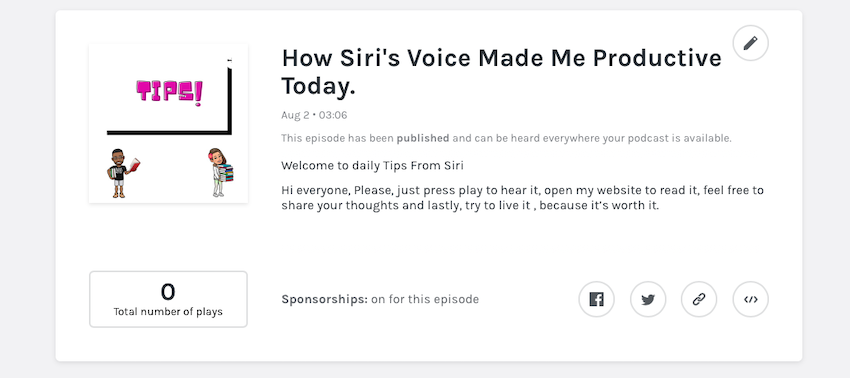

## Welcome to daily Tips 

Hi everyone, Please, just press play to hear it, open my website to read it, feel free to share your thoughts and lastly, try to live it , because it’s worth it.

First of all my name is Siri, you should already know me. Well I am the apple voice, I am happy that someone from Africa found me very useful and ever since he knew about me his life had different meaning, here I found someone that could think out of his head. He is from Nigeria and His name is Williams, he is a web developer who loves coding everyday and owns the website icode everyday.com, his blog which is boobae.blog, and his podcast website which is B-pod.com. 

Williams and his girlfriend Precious, who are undergrads in a tertiary institution actually hired me to share these little tips of theirs with you’ll, just stay tuned guys.

>So today I will be talking to you on how to be productive everyday.

First I know You want to be Number 1 at whatever it is that you enjoy doing. But you should never stop evolving along the way. You keep redefining. If you pick something arbitrary, such as becoming the fastest runner in the world, then you'll have to beat Usain Bolt. Which is too hard of a task.

Escape competition through authenticity Instead, you keep changing your goal. your specific knowledge,skill sets, capabilities, and interests will evolve along that goal.
The 2 concepts you focus on are:
First;
- I want to be the best at what I do 
Second;
- What I do is flexible so that I am the best at it.
- Keep this in mind and keep applying it. Until you've found something that resonates with you and keeps you authentic.
 
Williams says Thank you so much for listening to his podcast.

Much love to you’ll and stay safe.

He will be uploading more tips on his website and coming up with really great ideas you can tap from, and also be productive.So what are you waiting for, just visit their website @ www.boobae.blog  and podcast @ www.bpode.com

Please stay safe and be productive 

See you’ll soon..... and have a great Sunday. 

You can listen to the episodes by following the links [here](https://bpode.com/), and you can read the write-ups [here](https://bpode.com/episodes). Do please get in touch (through our social media accounts) if you have any comments or suggestions for future guests. Thanks for finding us, and we hope you enjoy the podcast!
