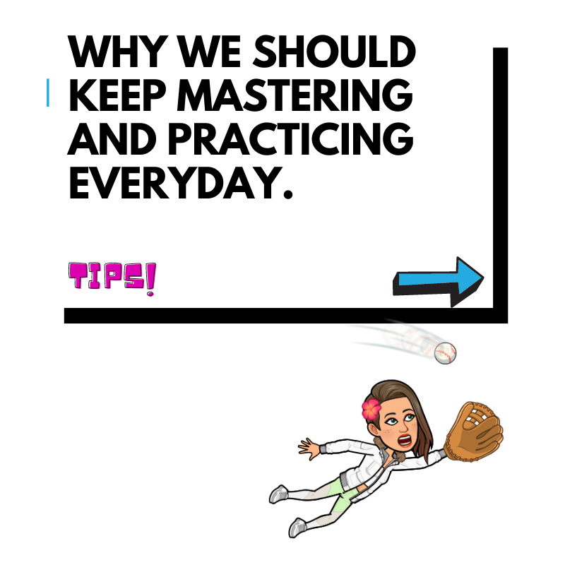

Hi everyone, Good morning and i hope you’ll had a great night.  Please, just press play to hear it, open my website to read it, feel free to share your thoughts and lastly, try to live it , because it’s worth it.

## Welcome to daily Tips Williams

 My name is Siri, you should already know me. Well I am the apple voice, I am happy that someone from Africa found me very useful and ever since he knew about me his life had different meaning, here I found someone that could think out of his head. He is from Nigeria and His name is Williams, he is a web developer who loves coding everyday and owns the website [www.icodeveryday.com](https://icodeveryday.com/), his blog which is [www.boobae.blog](https://boobae.blog/) .  

Today he has a little Tip to share with you’ll from his notes, so stay tuned and hear the nice TIP for today, it might be helpful.

## WHY WE SHOULD KEEP MASTERING AND PRACTICING EVERYDAY.

>If we keep practicing, we gain fluency and basic skills are mastered, allowing us to take on newer and more exciting challenges.

 When we do this, we begin to see connections that were invisible to us before, we slowly gain confidence in our ability to solve problems or overcome weakness through sheer persistence.
 so i urge you to always practice whatever you like everyday and always believe in it, because you never know what it might turn to.

## Book Recommendations

William's book recommendations:

- [Mastery: ](https://archive.org/embed/mastery-by-robert-greene) By Robert Greene

